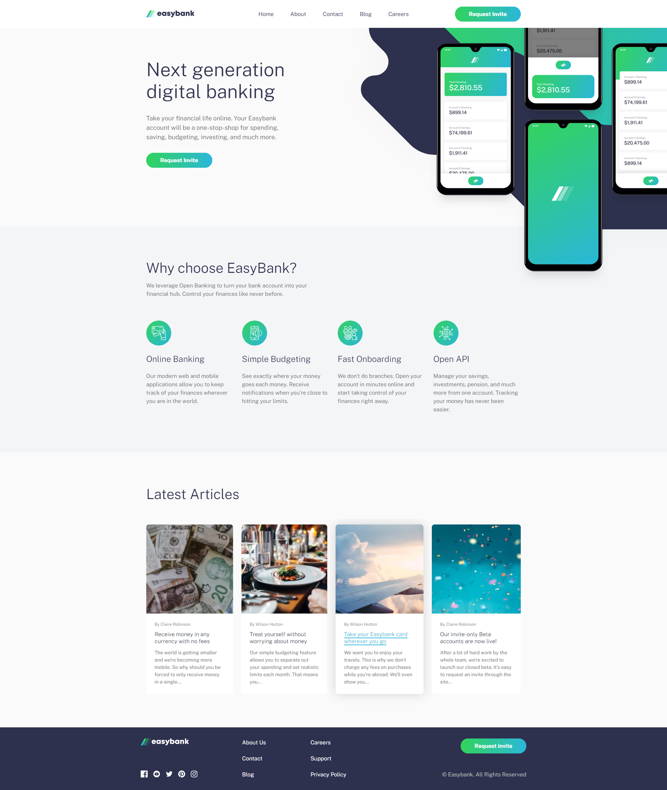
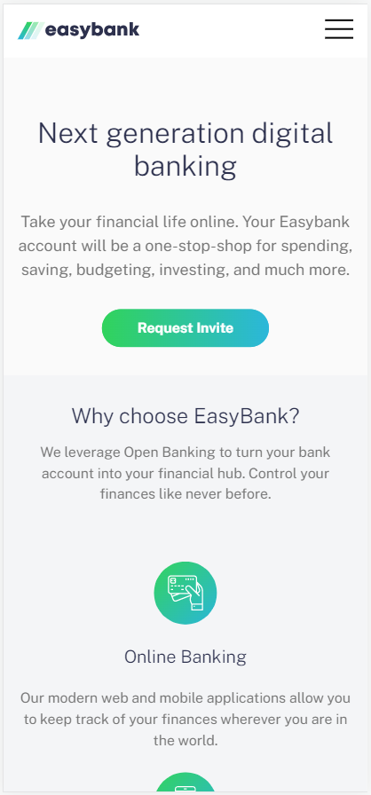
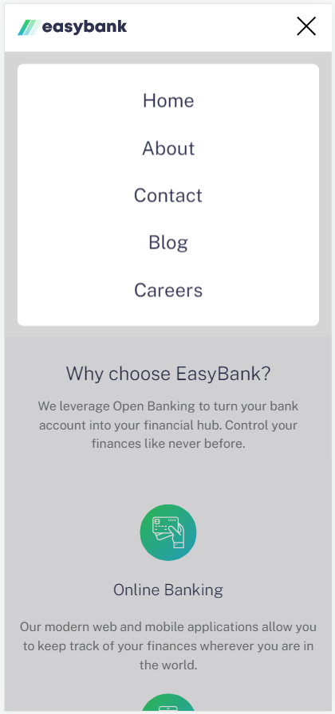

<h1 align="center">Easy Bank Landing Page</h1>
<p align="center">
  Made with <code>HTML</code>, <code>CSS</code>, <code>TypeScript</code>, <code>ReactJS</code>, <code>NextJS</code>, <code>styled-components</code>
  <br>
  Bootstrapped with <code>NextJS</code>
</p>

<p align="center">
  <a href="../../actions"></a>
  <a href="../../commits"></a>
  <a href="./LICENSE"></a>
  
  
</p>

<p align="center">
  <a href="#-screenshots">🖼 Screenshots</a> • 
  <a href="#ℹ%EF%B8%8F-about">ℹ️ About</a> • 
  <a href="#%EF%B8%8F-tools">⚙️ Tools</a> • 
  <a href="#-build-project">🔨 How to Build Project</a> • 
  <a href="#-file-structure">📁 File Structure</a>
</p>

<sup>
  <p align="center">
    <a href="#-npm-packages-worth-mentioning">📦 NPM Packages worth mentioning</a> • 
    <a href="#-details">💡 Details</a> • 
    <a href="#-useful-resources">🔗 Useful resources</a> • 
    <a href="#-author">👤 Author</a>
  </p>
</sup>

## 🖼 Screenshots

<p align="center">
  
</p>

<p align="center">
  
  
</p>

## ℹ️ About

This is a solution to the challenge "Easy Bank Landing Page" from Frontend Mentor ([link](https://www.frontendmentor.io/challenges/easybank-landing-page-WaUhkoDN/hub)).

The challenge is to build out the landing page and get it looking as close to the design as possible.

I made my own Figma prototype and redesigned the whole application.

Figma prototype: https://www.figma.com/file/tnMVDIPtXmz1Jl3LHMxhEX/Easy-Bank-Landing-Page?node-id=0%3A1&t=wQvBxKm7q40Sx9vg-0

## ⚙️ Tools

- **HTML5**
  - ReactJS
- **CSS**
  - styled-components
- **TypeScript**
  - ReactJS
  - NextJS
- **NodeJS**
- **Vercel**
- **Storybook**

## 🔨 Build project

<table>
  <tr>
    <th>Command</th>
    <th>Description</th>
  </tr>
  <tr>
    <td><code>npm&nbsp;install</code></td>
    <td>First of all install all required packages</td>
  </tr>
  <tr>
    <td><code>npm&nbsp;run&nbsp;dev</code></td>
    <td>Run the app in development mode</td>
  </tr>
  <tr>
    <td><code>npm&nbsp;run&nbsp;build</code></td>
    <td>Build the app</td>
  </tr>
  <tr>
    <td><code>npm&nbsp;run&nbsp;start</code></td>
    <td>Run the app in production mode. Use after <code>npm run build</code></td>
  </tr>
  <tr>
    <td><code>npm&nbsp;run&nbsp;storybook</code></td>
    <td>Run storybook (developmen environment for UI components)</td>
  </tr>
  <tr>
    <td><code>npm&nbsp;run&nbsp;build-storybook</code></td>
    <td>Build Storybook as a static web application</td>
  </tr>
  <tr>
    <td><code>npm&nbsp;run&nbsp;lint</code></td>
    <td>Check compliance with Eslint rules</td>
  </tr>
</table>

## 📁 File Structure

```Markdown
├── 📁 .github
│   └── 📝 dependabot.yml     Instructions for Dependabot
|
├── 📁 .storybook             Settings for Storybook
|
├── 📁 components                     React components
|   └── 📁 Component Name
|       ├── 📝 index.tsx          Component logic
|       ├── 📝 index.styled.tsx   Component styles
|       ├── 📝 index.stories.tsx  Storybook instructions (optional)
|       └── 📝 index.types.tsx    Component types (optional)
|
├── 📁 data                   Data for some sections of the page
│
├── 📁 docs                   Additional information, documentation
│   └── 📁 results            Screenshots of how the application works after being fully developed
|
├── 📁 global                 Global styles (styled-components)
|
├── 📁 hooks                  Custom React hooks
|
├── 📁 pages                      React page components
|   ├── 📝 _app.page.tsx          Global settings for the main page
|   ├── 📝 _document.page.tsx     Instructions for making styled-components work properly, for fonts
|   ├── 📝 index.page.tsx     Main page logic
|   └── 📝 index.styled.tsx   Page styles
|
├── 📁 public                     Static assets: images, icons, favicons
|
├── 📁 stories                    Storybook stories
|
├── 📁 utils                      Utility functions
|
├── 📝 .eslintrc.json         ESLint configuration file
├── 📝 .gitignore             Instructions for Git about what files to ignore
├── 📝 .npmrc                 Instructions for NPM (for Storybook to wrok properly)
├── 📝 LICENSE                MIT License. Basically you can do whatever you want with the code
├── 📝 README.md              Project description
├── 📝 next.config.js         NextJS configuration file
├── 📝 package-lock.json      Keeps track of the exact version of every package that is installed
├── 📝 package.json           Various metadata relevant to the project, scripts, dependencies
├── 📝 styled.d.ts            Types for styled-components
└── 📝 tsconfig.json          TypeScript configuration file
```

## 📦 NPM Packages worth mentioning

<table>
  <tr>
    <td><code>styled-components</code></td>
    <td>For CSS-in-JS</td>
  </tr>
  <tr>
    <td><code>animejs</code></td>
    <td>Library for animations</td>
  </tr>
  <tr>
    <td><code>@storybook/...</code></td>
    <td>Development environment for UI components</td>
  </tr>
</table>

## 💡 Details

Thought project is extremely simple I spent much time learning NextJS, AnimeJS.

Btw, that's my first project on NextJS. 

Previous projects were usually bootstrapped with Vite. I couldn't make Vite and Storybook work together. Although, I managed to make NextJS and Storybook work together. Finally!

Features

- NextJS!
- Storybook
- Nice animations with Animejs
- Deployment to Vercel

## 🔗 Useful resources

- [NextJS Foundations](https://nextjs.org/learn/foundations/about-nextjs) - Introduction to NextJS
- [AnimeJS](https://animejs.com/) - AnimeJS official documentation
- [Storybook](https://storybook.js.org/) - Storybook official documentation
- [Web Dev Simplified Hooks Course](https://courses.webdevsimplified.com/view/courses/react-hooks-simplified/1411296-introduction/4376388-00-introduction) - Great course with a lot of custom hooks
- [StyledComponents template for NextJS](https://github.com/vercel/next.js/tree/canary/examples/with-styled-components) - Is very useful when you need to set up NextJS with Styled Components. I tried several approaches, only this one worked properly

## 👤 Author

- Frontend Mentor - [@GrbnvAlex](https://www.frontendmentor.io/profile/GrbnvAlex)
- Telegram - [@Arlagonix](https://t.me/Arlagonix)
- Github - [@arlagonix](https://github.com/arlagonix)
